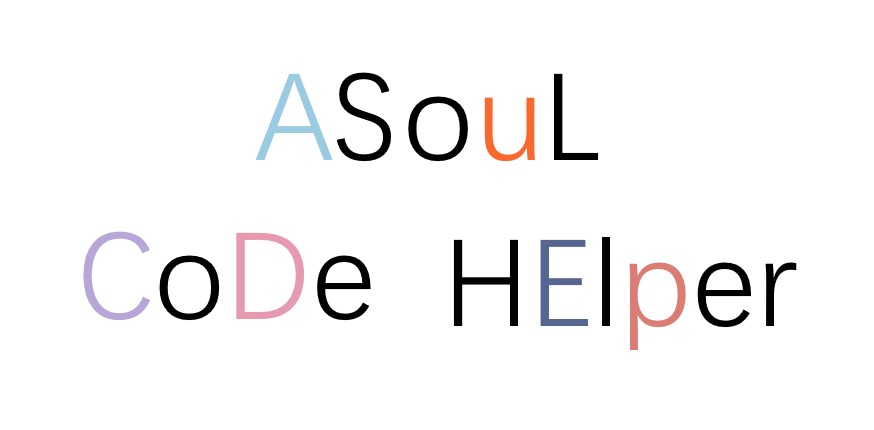
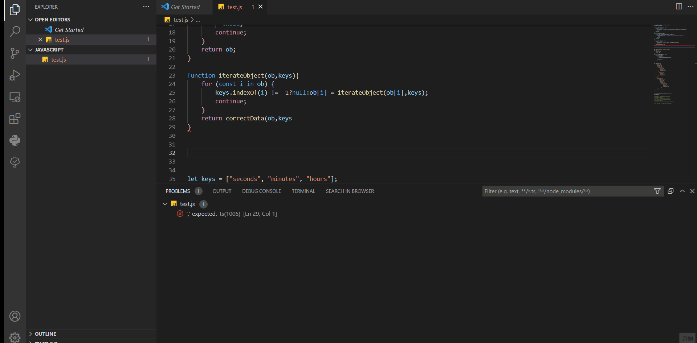
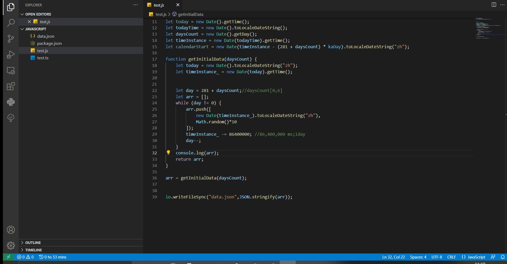
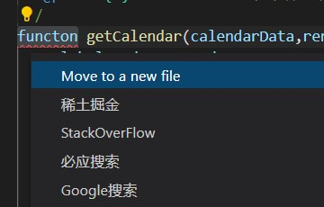

### 简介

🎉**ASoul_CodeHelper**，一款以提效为主题的VSCode插件，为字节跳动旗下稀土掘金社区2022年春季Hackathon浏览器插件赛道参赛作品，同样是作者本人作为ASoul粉丝的粉丝向作品。

目前包括两块功能：🎈**报错快速搜索（Problem Searcher）**与⏰**代码时长统计（Coding Statistic）**。

- 🎈报错快速搜索提供了一键快捷搜索报错的方式。可自定义配置的搜索方案以及通过附加tag的搜索将使大大减少不必要的查错时间开销。

- ⏰代码时长统计将记录你每一日的代码时长，包括语言使用时长统计与开发项目的时长统计。插件同样提供了一个内置的仿Github Calendar的可视化页面，它将与ASoul成员一起记录你过去努力的点滴，并且支持导出统计记录为png、svg等格式的图片与用户自定义视图。

目前插件还在缓慢开发中......如果您有遇到什么问题或有什么好的意见，务必在Issue（如果可以尽量发Issue提😭我也想过一把项目有人发issue的瘾）或发邮件至leewendao@outlook.com反馈。

### 如何使用

安装插件后，默认会启用所有模块。

🎈**报错快速搜索（Problem Searcher）**：当出现报错时，在问题的旁边会出现一个小灯泡（通常是黄色，偶尔会因为其他插件的缘故便为蓝色），点击灯泡即可弹出报错快速搜索的列表。点击即可自动打开浏览器搜索报错。

⏰**代码时长统计（Coding Statistic）**：在该模块启用时，它会自动进行数据的统计。其中，左下角的状态栏会出现一个显示你今日