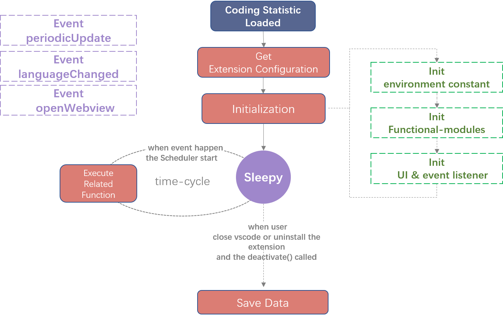
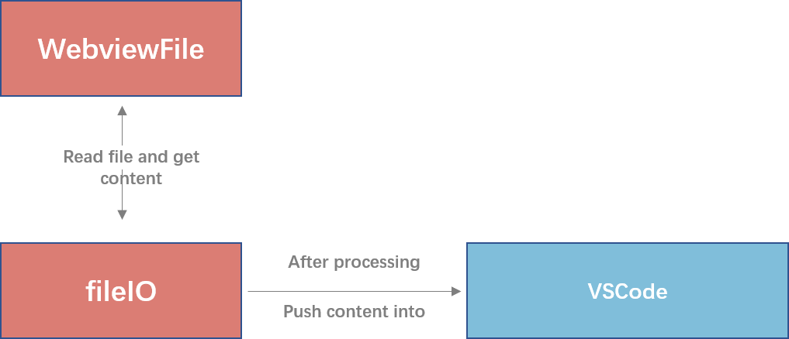

# 部分程序设计细节说明

##### 1.总抽象层

ASoul_CodeHelper按照OOP的范式进行程序设计，对于各功能模块做了良好的封装。总体而言，程序的抽象层如下图所示：


下面将对**有必要详述的抽象层与对应的功能块**进行阐述。

##### 2.Module Loader/插件激活事件

VSCode插件的加载机制是这样的：在启动时先读取所有插件的配置文件，根据配置文件中的激活环节来决定是否激活插件。插件的大多数功能都是通过VSCodeExtensionAPI注册相关信息到VSCode的里面的。


而ASoul_CodeHelper将会在VSCode完成启动后自动进行加载。由于ASoul_CodeHelper本身是一个包含多功能（或者说**模块Module**）的插件，为了方便用户启用/禁用自己需要/不需要的模块，我们引入了**Module Loader**这一层抽象。Module Loader将在插件被激活时读取用户的配置文件，根据配置文件中模块是否启用的信息决定是否加载该模块。这一流程示意图如下：


用户可以便捷地在插件设置中决定是否启用相应的功能模块：


这一设计使得用户可以有选择的关闭个别模块以提升VSCode的启动速度，而无需禁用插件:


<div align='center'><i>加载了全部模块的插件启动速度</i></div>


<div align='center'><i>关闭所有模块的启动速度</i></div>

##### 3.Module:Coding Statistic

从**流程**上讲，代码时长统计模块在加载时，它的流程图如下：



在加载时，它将首先获取插件的配置信息，之后依次初始化必要的环境常量（今日时间、本地数据的存储目录等）、子功能模块的实例以相应的事件监听器与UI后，它将进入休眠状态，直到对应事件发生后，才会调用调度器（子功能模块中的一部分）或是VSCode自身的相应命令执行对应的功能函数。

目前的激活事件有：

- **周期更新(periodicUpdate)**，它将周期性地被唤起，届时将更新数据并保存数据到本地。
- 使用的**编程语言发生了改变(languageChanged)**。它将在用户使用不同语言编程时被唤起，届时它会更新数据但不保存数据。
- 打开**可视化界面(openWebview)**。它将调用VSCode的命令，打开一个内置的Webview窗口。

在用户关闭VSCode时，插件会自动保存数据到本地。

值得一提的是，Webview的代码是与程序代码解耦的。在打开可视化界面时，实际上是由CodingStatistic的fileIO模块读取了本地的Webview文件（一个Html文件，存放在`/resources/index.html`），经过简单处理后，将其内容传入VSCode内置的WebViewAPI实现的:




<div align='center'><i>Webview内容获取草图</i></div>

因此，如果用户自己熟悉html css等内容，可自己在`resources`文件夹下更改可视化页面的样式。


从**抽象层**上来讲，代码时长统计模块主要包括两个抽象层：功能层**(function)**和视图层**(view)**。它们包含的子模块见下图：


各子模块的功能描述与设计原因见下表：

|    名称    |                             描述                             |
| :--------: | :----------------------------------------------------------: |
| Maintainer | 维护器，它主要用于维护今日的代码时长数据。为了减少与本地的IO操作，我们在内存中存储更新数据。只有在调度器发起保存数据的指令时维护器才会将内存中的数据取出，返回给调度器，供其调用fileIO模块将数据写入到本地文件中。 |
| Scheduler  | 调度器。由它来调用各个子模块的执行。它是一个使用策略模式封装了函数、从而实现多态的对象。 |
|   fileIO   |    封装了VSCode内置的Nodejs的fs模块。用于本地数据的读写。    |
|  UI View   | 显示在用户界面的UI，它是一个显示当日总代码时长的StatusBar。  |
|  WebView   |                  本地统计数据的可视化页面。                  |

其中最核心的是Maintainer、Scheduler、fileIO这三个模块。这三个模块之间的调用关系简单示意图如下：


Scheduler本身是一个实现了多态的对象，它的代码形如此：

```javascript
scheduler = {
    let that = this;
    periodicUpdate: function () {
                that.theStatusBar.text =
                    "$(clock) "+that.theMaintainer.updateData(ContextInfo.CONTEXT_PERIODIC) as string;
            },
    saveLocalData:function(){
                io.updateLocalData(that.kDataPath + "\\" + (that.kDateTime.split("/")[1]) + ArgsInfo.JSON,
                  that.theMaintainer.getLocalData(), ContextInfo.CONTEXT_COMMAND)
            }
    .........
}
```